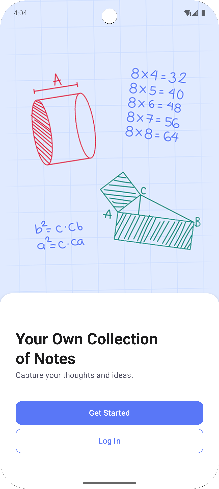
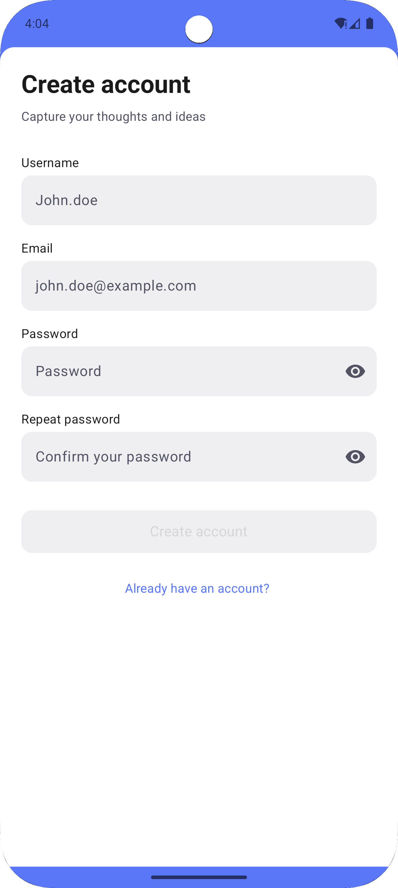
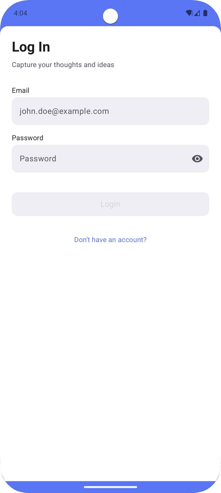
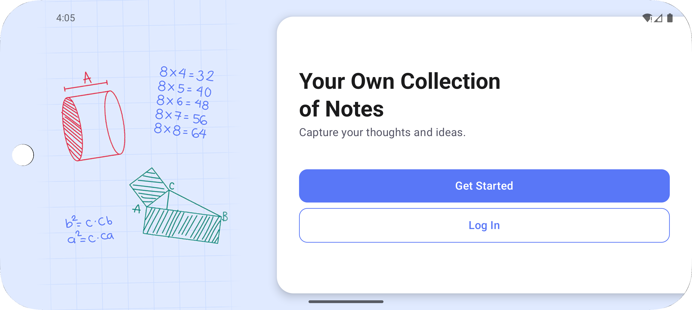
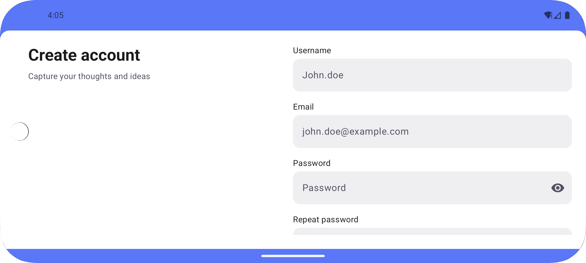
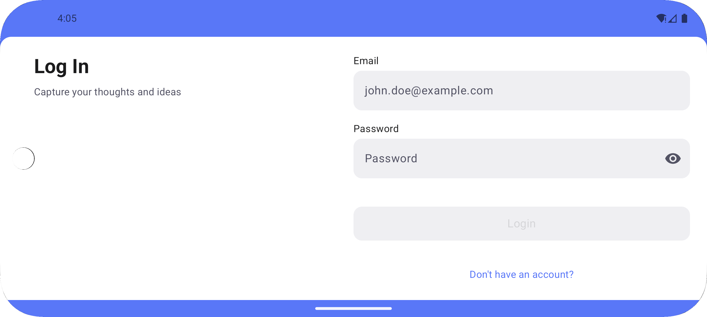
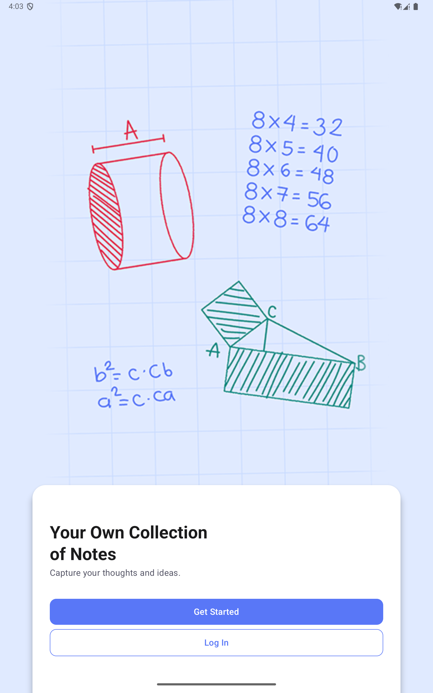
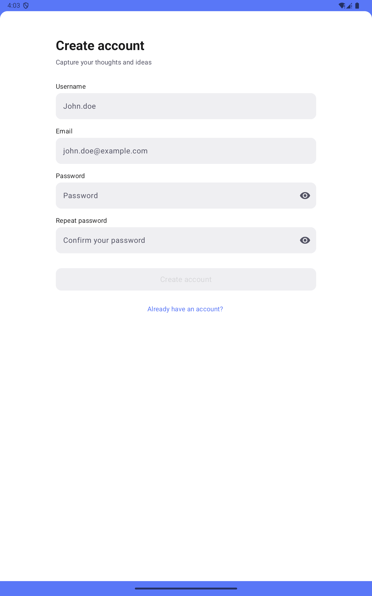
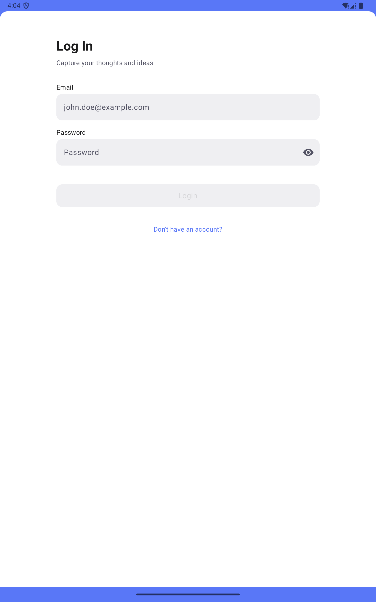

# NoteMark

## Milestone #1 Goal

**Get users in the door and greet them with style and substance.**

- Your mission: create the opening experience of NoteMark. From a minimalist splash screen to a
  welcoming landing page, this milestone gets users through the front door. It includes functional
  login and registration flows with full validation, error handling and session creation — this is
  where the journey begins!

## Screenshots

### Portrait Mobile Screenshots

  
  
  

### Landscape Mobile Screenshots

  
  
  

### Tablet Screenshots

  
  
  

### Milestone #1 Video
